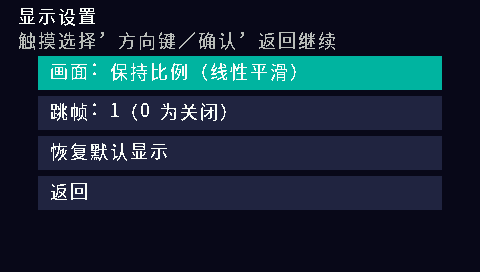

# BBK H1 GameBoy（H1-GBA）

步步高 H1 / Y100 的原生 GB、GBC、GBA 模拟器，系统应用标题为 **GameBoy**。
基于 [H1 BDA SDK](https://github.com/MrDefinition1999/bbk-h1-bda-sdk)、
[gpSP](https://github.com/libretro/gpsp) 和 [gnuboy](https://github.com/rofl0r/gnuboy)，
移植参考 [BBK9588-gba](https://github.com/HelloClyde/BBK9588-gba)。

当前版本 **v0.12.3**：GBA MIPS JIT、原生 PCM 音频、系统文件选择器、加载进度、
组合按键、触摸暂停菜单、三槽即时存档、GBA RTC，以及 MXU1 加速的保持比例线性平滑缩放。
适配固件 **H1 V1.41**。此前已根据真机日志优化运行耗时；本次发布的确切构建经过
MIPS 回归和完整固件模拟器验证，**v0.12.3 MXU 路径的真机速度仍待测试**。

## 快速开始

从 [Releases](https://github.com/HelloClyde/BBKH1-GBA/releases) 下载
`BBKH1-GBA-v0.12.3-install.zip`，把其中 `应用` 和 `GBA` 目录合并复制到 H1 的 A 盘根目录。
应用路径为 `A:\应用\程序\GameBoy.bda`；在系统应用菜单找到 **GameBoy** 后启动。
也可以下载 `H1GBA.bda`，重命名为 `GameBoy.bda` 后复制到上述目录。

把自己的 `.gba`、`.gb`、`.gbc` 文件放到 `A:\GBA\`，启动后通过 H1 系统文件选择器打开。
支持中文文件名，也可选择其他目录；不需要 `roms.txt`。首次打开会显示加载进度条。
本项目不附带商业 ROM、Nintendo BIOS、H1 固件或设备 dump；GBA 使用 gpSP 随附的开放 BIOS。

| 默认实体键 | 功能 |
| --- | --- |
| 方向键 | 十字键，支持与其他游戏键同时按下 |
| Z / 确认 | A |
| X | B |
| A / S | L / R（仅 GBA） |
| Enter / 空格 | Start / Select |
| 触摸游戏画面 / P | 暂停与设置菜单 |
| V | 原始大小 → 保持比例 → 全屏拉伸 → 保持比例线性平滑 |
| F | 跳帧 0 / 1 / 2 |
| M | 保存并选择另一个游戏 |
| Escape / 返回 | 保存并退出 |

暂停菜单支持修改按键映射、三槽即时存档/读档、显示模式、跳帧、声音开关、换游戏及退出。
默认显示为快速保持比例模式，GBA 为 408×272，GB/GBC 为 302×272；画面写入原生游戏帧缓冲。
线性模式横纵双向插值，使用 MXU1 并在启动时校验像素结果，失败时回退标量路径。
线性模式的负担仍高于普通保持比例模式。

电池存档在 ROM 旁边，例如 `game.gba.s0/.s1`；即时存档使用 `.st1.s0/.s1` 等，
设置使用 `.cfg.s0/.s1`，GBA RTC 使用 `.rtc.s0/.s1`。请一起备份这些文件。
它们带 ROM 身份和 CRC 校验，不能直接当作其他模拟器的 `.sav` 使用。
GBA RTC 接入 H1 日历并补偿离线时间；GB/GBC MBC3 时钟随游戏运行推进，关闭期间不推进。
即时存档不承诺与其他模拟器或未来核心版本互通。详见 [暂停菜单](docs/h1-pause-menu.md)。

日志为 `A:\GBA\h1gba.log`，确保目录可写。每次启动覆盖日志，复现问题后先复制日志再启动。
普通版只记录关键阶段；`H1GBA-profile.bda` 用于耗时分析，安装时同样重命名为 `GameBoy.bda`。
性能包有采样开销，不建议作为日常版本。分析：

```powershell
python tools/analyze_profile.py h1gba.log --output profile.json
```

开发者在 Windows 上从源码构建（Python 3.12、Git）：

```powershell
git clone --recurse-submodules https://github.com/HelloClyde/BBKH1-GBA.git
cd BBKH1-GBA
python -m pip install -r requirements.txt
python tools/install_toolchain.py
python tools/build.py --toolchain .tools/toolchain/bin
python tools/build.py --toolchain .tools/toolchain/bin --profile
python tools/verify_release.py
```

输出 `dist/H1GBA.bda`、`dist/H1GBA-profile.bda`、对应 `.sha256` 和 `.build.json`。
工具链下载按 SHA-256 校验，固定为经过验证的 GCC 15.2.0；可用 `--toolchain` 或
`H1_GNU_BIN` 指定已有 `mipsel-none-elf-{gcc,g++,nm,objcopy}` 目录。
固定 H1 SDK 没有 GNU 工具链安装器，因此本项目提供自己的安装脚本。
Windows 工具链目录建议仅含 ASCII 字符，避免链接器找不到 `libgcc`。
菜单位图已经包含在源码中，构建不依赖本机字体；再生方法见 [资源说明](assets/README.md)。

下载 Release 的 `*-source.zip` 可获得包含固定依赖的完整源码；GitHub 自动生成的
Source code ZIP 不包含子模块。完整源码包可直接构建，依赖版本记录在 `SOURCE-REVISION.json`；
继续开发时推荐使用上面的递归 clone 命令。

## 截图

以下为本项目发布构建的真实帧缓冲截图。测试使用原创 homebrew ROM，菜单与画面没有使用效果图。

| 触摸暂停菜单（完整 H1 固件模拟器） | 显示设置（完整 H1 固件模拟器） |
| --- | --- |
|  |  |

GB/GBC 测试画面：普通发布 BDA 在 Unicorn 中执行，H1 固件服务使用替身。


截图、BDA 哈希及测试范围见 [发布验证记录](docs/release-v0.12.3.md)。

## 依赖

使用成品需要 H1 / Y100、V1.41 固件，以及可写的 ROM 和日志目录。其他固件版本未验证。
GBA 最大 32 MiB，使用 2 MiB 分页缓存；不需要外部 BIOS。没有金手指或联机功能。

| 开发依赖 | 固定版本 / 提交 | 用途 |
| --- | --- | --- |
| [bbk-h1-bda-sdk](https://github.com/MrDefinition1999/bbk-h1-bda-sdk) | `067fe072477861dfc8949d7b1a55279fb92d2548` | H1 API、BDA 打包与校验，Apache-2.0 |
| [libretro/gpSP](https://github.com/libretro/gpsp) | `69e86ebe89f14c3f5f75b809c12c0a953b3d6ce4` | GBA 核心，GPL-2.0-or-later |
| [gnuboy](https://github.com/rofl0r/gnuboy) | `c367bb4ba96fb07cd62f72f5ecb43aeff7012564` | GB/GBC 核心，GPL-2.0-or-later |
| GNU MIPS Windows 工具链 | GCC 15.2.0，安装脚本固定 ZIP 哈希 | 交叉编译 |
| Python / Pillow / Unicorn | 3.12 / 12.3.0 / 2.1.4 | 构建资源及 MIPS 测试 |
| 本机 GCC | 可通过 `HOST_CC` 指定 | 平台 C 回归测试 |
| [Noto Sans CJK SC](https://github.com/notofonts/noto-cjk) | 字体提交见资源说明，OFL-1.1 | 菜单字体再生，仅需再生时下载 |

上游子模块保持原样，H1 补丁由 `tools/prepare_gpsp.py`、`tools/prepare_gnuboy.py`
在 `build/` 副本中重现。项目移植代码按 GPL-3.0-or-later 发布；第三方代码与字体保留各自许可，
详见 [LICENSE](LICENSE)、[NOTICE](NOTICE.md)。

本地主要检查：

```powershell
python tests/run_platform_tests.py
python tests/mips_smoke.py --bda dist/H1GBA.bda --menu
python tests/pause_menu_smoke.py --bda dist/H1GBA.bda --map build/release/H1GBA.map
python tests/linear_mxu_smoke.py --bda dist/H1GBA.bda
python tests/audio_smoke.py
python tools/build.py --toolchain .tools/toolchain/bin --test-frames 20
python tests/gb_smoke.py
python tests/rtc_smoke.py
```

GitHub Actions 在 main、PR 和手动运行时构建并验证；版本标签成功构建后发布同一次构建的资产。
标签构建还须与记录的运行验证哈希一致。CI 的 Unicorn 测试使用固件服务替身，不能替代
完整固件模拟器或真机速度测量。完整固件环境需自行提供 dump 和恢复内核，见
[模拟器测试说明](docs/h1-emulator-test.md)。

## 感谢

- [MrDefinition1999](https://github.com/MrDefinition1999)：H1 BDA SDK 与 H1 模拟器。
- [Exophase 及 libretro/gpSP 贡献者](https://github.com/libretro/gpsp)：GBA 核心与 MIPS 动态重编译。
- [Laguna、Gilgamesh、rofl0r 及 gnuboy 贡献者](https://github.com/rofl0r/gnuboy)：GB/GBC 核心。
- Normmatt、VBA / VBA-M 团队：gpSP 使用的开放 GBA BIOS。
- [HelloClyde/BBK9588-gba](https://github.com/HelloClyde/BBK9588-gba)：移植结构与 freestanding libc 参考。
- Google / Adobe / Noto 字体贡献者：开放中文字体。
- 提供 H1 实机日志、dump、应用接口参考及测试反馈的用户。
